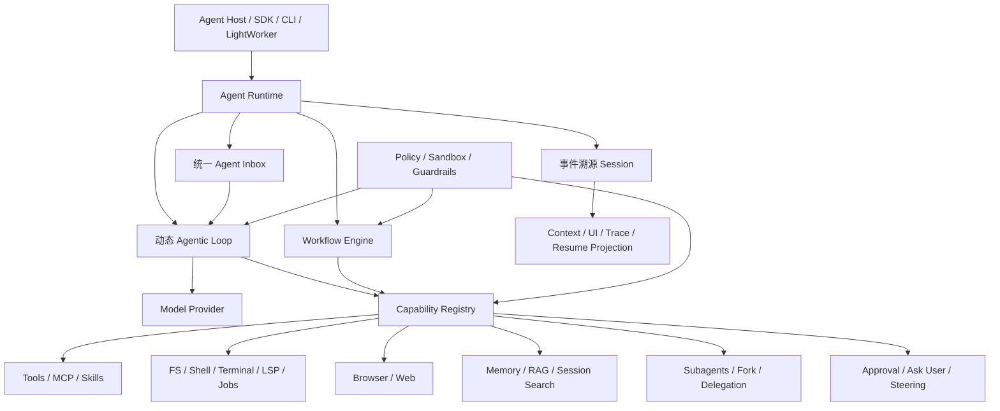

# LightAgent 后续版本 Roadmap

> 状态：Draft
>
> 基线版本：LightAgent 0.9.7
>
> 适用范围：LightAgent 核心运行时、官方 Provider、SDK 和兼容层
>
> 规划原则：版本范围是兼容性检查点，不是一次只能推进一个方向；各工作流可以并行开发，但必须依次通过版本发布门槛。

## 1. 背景

LightAgent 0.9.7 已经具备单 Agent 工具循环、LightSwarm、多模型、MCP、Memory、Skills、Runtime Hooks、Guardrails、Trace、Human Approval 和 LightFlow 等能力。

后续版本的重点不再是继续把所有功能直接加入 `LightAgent` 主类，而是建立稳定的运行时基础，使编码、研究、分析、写作、浏览器操作、知识检索和长任务可以在同一个 Agent Runtime 中按需组合。

LightAgent 将从“轻量 Agent 类库”演进为：

> 一个轻量、可嵌入、事件驱动、能力可组合，同时支持动态 Agentic Loop 和确定性 Workflow 的通用 Agent Runtime。

## 2. 总体目标

### 2.1 核心目标

1. 保持 `LightAgent.run()` 一行调用的简单体验。
2. 使用同一个运行时处理编码任务与非编码任务，不再按任务类型切换两套执行框架。
3. 同时支持动态 Agentic Loop 和固定 Workflow，并允许二者相互调用。
4. 使模型、工具、文件系统、Shell、浏览器、Memory、RAG、子 Agent 等能力可以替换和按作用域组合。
5. 支持可暂停、可恢复、可引导、有预算限制的长任务。
6. 支持多 Agent、子 Agent 和独立任务并行，并保证权限和写入边界明确。
7. 让上下文、WebUI、Trace、恢复和审计都从同一份事件记录派生。
8. 高风险行为必须经过 Sandbox、Policy 和 Approval，不能只依赖 Prompt 约束。
9. 核心保持轻量；浏览器、Docker、向量数据库和 WebUI 作为可选 Provider 或上层产品能力存在。

### 2.2 非目标

以下内容不应成为 LightAgent 核心的强制依赖：

- Agentica 或 DeepSeek Harness 运行时；
- LangChain、LlamaIndex；
- Playwright、DrissionPage；
- Docker SDK 或具体容器实现；
- 向量数据库或 Embedding 服务；
- FastAPI、WebUI 或桌面应用；
- Git 工作区管理和代码 Worker 专用流程；
- 运行时自修改代码；
- 默认开放的宿主机 Shell。

LightAgent 可以参考其他 Agent Harness 的设计，但不引入新的外部 Agent Runtime 依赖。

## 3. 设计原则

### 3.1 轻量核心，可选实现

核心包只提供协议、运行时和最小实现。网络、浏览器、LSP、RAG、持久终端等通过可选依赖或独立 Provider 提供。

### 3.2 模型可见内容必须可重建

任何进入模型请求的消息、工具结果、Memory、Skill、审批结果、引导信息和压缩摘要，都必须在 Session EventLog 中存在可重建记录。

### 3.3 能力与策略分离

Provider 负责“如何执行”，Policy 负责“是否允许执行”。例如 BrowserProvider 提供点击能力，PolicyProvider 决定某次提交按钮点击是否需要审批。

### 3.4 权限只可缩小

子 Agent、Workflow Step 和 Skill 只能继承或缩小父级权限，不能从任务内部扩大权限。

### 3.5 异步优先，同步兼容

内部以原生异步执行为标准，`run()` 等同步 API 作为兼容封装，不再让核心调度依赖为每次异步调用创建线程和事件循环。

### 3.6 失败必须显式

模型失败、工具失败、策略拒绝、预算耗尽、审批等待、上下文溢出和 Provider 不可用必须拥有不同状态与错误码。

## 4. 目标架构



### 4.1 核心组件

| 组件 | 职责 |
| --- | --- |
| `AgentRuntime` | 管理 Agent 生命周期、Turn、Step、取消、预算和错误收敛 |
| `AgentLoop` | 动态执行模型请求和工具调用 |
| `AgentInbox` | 接收初始请求、排队消息、引导、上下文和审批回复 |
| `Session` | 保存追加式、带版本的运行事件 |
| `SessionStore` | 提供持久化、恢复、Fork、查询和迁移 |
| `ContextProjector` | 从 Session EventLog 派生模型上下文 |
| `CapabilityRegistry` | 注册、发现、解析和卸载 Provider |
| `PolicyEngine` | 统一 Guardrails、权限、Sandbox 和审批判断 |
| `WorkflowEngine` | 执行固定或动态 Workflow |
| `GoalManager` | 管理目标、验收条件、子目标和预算 |
| `JobManager` | 管理后台命令、终端操作和子 Agent 任务 |

## 5. Capability Registry

### 5.1 定位

保留 LightAgent 0.9.7 的公开 API，在其上增加统一的能力注册、发现、生命周期、作用域和策略接口。

LightAgent 核心依赖 Provider Protocol，不直接依赖 Docker、Playwright、向量数据库或具体模型 SDK。上层产品可以替换 Provider，而不修改 Agent Loop。

### 5.2 标准 Provider

| Provider | 职责 |
| --- | --- |
| `FileSystemProvider` | 文件读取、写入、编辑、搜索、版本检测和访问范围控制 |
| `ShellProvider` | 单次命令执行、环境变量、工作目录、超时和输出限制 |
| `TerminalProvider` | 持久终端、PTY 会话、输入输出、信号和关闭 |
| `BrowserProvider` | 页面导航、点击、输入、截图、下载和 Profile 管理 |
| `WebProvider` | Web 搜索、HTTP Fetch、正文提取、来源和引用元数据 |
| `LSPProvider` | 诊断、符号搜索、定义跳转、引用查找和代码操作 |
| `MemoryProvider` | Working、Session、Workspace、User 和 Shared Memory |
| `RAGProvider` | 文档摄取、切片、索引、检索、Rerank 和引用读取 |
| `SubagentProvider` | 子 Agent 创建、Fork、通信、中断、恢复和结果收集 |
| `WorkflowProvider` | 固定 Workflow、动态 Workflow、状态持久化和恢复 |

同时定义以下基础 Provider：

- `ModelProvider`
- `ToolProvider`
- `InteractionProvider`
- `SessionProvider`
- `SandboxProvider`
- `PolicyProvider`
- `CredentialProvider`
- `TelemetryProvider`

### 5.3 统一 Provider 协议

```python
from typing import Any, Protocol


class CapabilityProvider(Protocol):
    name: str
    version: str
    capabilities: set[str]

    async def mount(self, context: "RuntimeContext") -> None:
        """注册能力，但不开始处理任务。"""

    async def start(self) -> None:
        """启动连接、进程或后台资源。"""

    async def health(self) -> "ProviderHealth":
        """返回当前健康状态和降级信息。"""

    async def reload(self, config: dict[str, Any]) -> None:
        """安全应用新配置。"""

    async def stop(self) -> None:
        """停止后台工作并等待资源收敛。"""

    async def unmount(self) -> None:
        """撤销工具、Hook、事件监听器和资源注册。"""
```

每个 Provider 必须声明：

- 名称和版本；
- 提供的 Capability；
- 所需依赖；
- 配置 Schema；
- 并发模式；
- 是否包含读、写、网络、执行或持久化行为；
- 默认风险等级；
- 是否需要 Sandbox；
- 是否支持取消和恢复；
- 输出上限和超时策略；
- UI 展示类型；
- 健康检查和降级方式。

### 5.4 Registry API

```python
registry.register(provider)
registry.unregister("browser")
registry.get(BrowserProvider)
registry.list()
registry.health()
registry.reload("web", config)
registry.resolve("browser.navigate", agent_context)
```

Provider 支持三个作用域：

```python
registry.register(provider, scope="runtime")
registry.register(provider, scope="session")
registry.register(provider, scope="agent")
```

解析优先级：

```text
Agent Provider
    ↓
Session Provider
    ↓
Runtime Provider
    ↓
Default Provider
```

示例权限配置：

- Research Agent：Web、只读 Browser、只读 Memory；
- Code Agent：FileSystem、Docker Shell、Terminal、LSP；
- Review Agent：只读 FileSystem、Diff、测试结果；
- Supervisor：Subagent、Workflow、Goal，但默认不直接写文件。

### 5.5 Provider 行为要求

#### FileSystemProvider

标准能力：

- `read`
- `write`
- `edit`
- `list`
- `glob`
- `grep`
- `stat`
- `diff`
- `remove`
- `move`

写入前必须执行路径策略检查。返回的文件版本必须支持 read-before-write 和并发修改检测。删除、移动和覆盖写入默认是高风险能力。

#### ShellProvider

使用结构化参数执行：

```python
await shell.execute(
    argv=["pytest", "-q"],
    cwd="workspace",
    timeout=300,
)
```

核心接口不应只接受拼接后的 Shell 字符串。是否允许 `bash -c`、网络、安装依赖或访问宿主机，由 Provider 与 Policy 决定。

#### TerminalProvider

TerminalProvider 与 ShellProvider 分离：

- ShellProvider：一次命令，一次结果；
- TerminalProvider：持续存在的交互会话。

标准能力包括创建、列出、读取、发送输入、发送信号、调整窗口大小、关闭终端和转换为后台 Job。

#### BrowserProvider

统一 Playwright、DrissionPage、Chrome 或远程浏览器实现：

```python
browser.navigate(url)
browser.snapshot()
browser.click(selector)
browser.type(selector, text)
browser.screenshot()
browser.download(...)
```

Provider 必须声明 Profile 是否临时、是否允许持久登录、下载、上传、内网访问、人工接管和视觉定位。登录、提交、上传、下载和持久 Profile 默认要求策略检查或审批。

#### WebProvider

WebProvider 用于搜索、HTTP 请求和正文提取；BrowserProvider 用于需要页面状态和交互的任务。

```python
WebDocument(
    url=...,
    title=...,
    content=...,
    fetched_at=...,
    published_at=...,
    source=...,
    citation_id=...,
)
```

标准结果必须保留来源、抓取时间和引用标识，使最终输出可以生成可点击引用。

#### LSPProvider

标准能力包括 diagnostics、definition、references、symbols、hover、rename preview 和 code actions。

LSP 只能提供代码理解或修改建议。实际写入必须通过 FileSystemProvider，避免绕过路径、版本和审批策略。

#### MemoryProvider

统一五类作用域：

```text
WorkingMemory
SessionMemory
WorkspaceMemory
UserMemory
SharedMemory
```

每条 Memory 必须携带来源、作用域、所有者、创建时间、TTL、可信度、敏感级别和写入审批状态。

#### RAGProvider

标准能力：

```python
rag.ingest()
rag.remove()
rag.list_documents()
rag.search()
rag.read_chunk()
rag.reindex()
```

检索结果必须包含文档、Chunk、位置和来源引用。官方最小实现使用 SQLite FTS5；Embedding、向量库、Rerank 和混合检索保持可选。

#### SubagentProvider

标准能力：

- `spawn`
- `fork`
- `send_message`
- `interrupt`
- `resume`
- `list_agents`
- `collect`

子 Agent 创建时冻结权限快照，不能自行扩大权限。Provider 同时支持一次性子 Agent 和可继续通信的持久子 Agent。

#### WorkflowProvider

支持固定 Workflow 和动态 Workflow：

```python
workflow.start()
workflow.status()
workflow.pause()
workflow.resume()
workflow.cancel()
workflow.rerun_step()
workflow.get_result()
```

Workflow 子步骤复用 Capability Registry、Session EventLog、Policy、Approval 和 Budget，不建立另一套工具协议。

### 5.6 配置示例

```yaml
capabilities:
  filesystem:
    provider: local-sandbox
    scope: workspace
    mode: workspace-write

  shell:
    provider: docker
    approval: always
    network: false

  terminal:
    provider: docker-pty
    enabled: true

  browser:
    provider: playwright
    profile: temporary
    persistent_login: false

  web:
    provider: builtin-http
    public_network_only: true

  lsp:
    provider: stdio
    enabled_languages:
      - python
      - javascript
      - typescript

  memory:
    provider: sqlite
    scopes:
      - working
      - session
      - workspace

  rag:
    provider: sqlite-fts5
    embeddings: false

  subagent:
    provider: in-process
    max_depth: 2
    max_agents: 8

  workflow:
    provider: lightflow
    checkpoint: true
```

## 6. 版本路线

## v0.10：事件溯源运行时基础

### 目标

建立后续能力的统一底座，同时保持 0.9.x API 兼容。

### 主要内容

- 新增 `Session`、`SessionEvent`、`SessionStore`；
- Session EventLog 成为模型上下文的唯一事实源；
- 区分持久 Session Event 和实时 Runtime Event；
- 支持 JSONL 与 SQLite SessionStore；
- 支持会话恢复、导出、回放和事件分页；
- 当前 `TraceRecorder` 改为 EventLog Projection；
- 增加事件版本号、Schema 校验和迁移机制；
- 新增原生异步入口 `agent.arun()`；
- 将同步 `run()` 保留为兼容封装；
- 定义 Turn、Step、Message、Model、Tool、Approval、Error 和 Session 生命周期事件。

建议的基础事件：

```text
session.started
turn.started
message.received
step.started
model.requested
assistant.chunk
assistant.completed
tool.requested
tool.completed
approval.requested
approval.decided
step.completed
turn.completed
session.completed
session.failed
```

### 发布门槛

- 任意模型请求都能从持久事件重建；
- 工具调用和工具结果不会产生不平衡记录；
- 进程中断后能够明确标记未完成 Turn；
- 原有 `run()`、流式输出、Trace、Hooks 测试继续通过；
- 0.9.7 用户无需修改代码即可升级。

## v0.11：Capability Registry 与统一策略层

### 目标

完成第 5 节定义的 Capability Registry，使工具、执行环境、知识和多 Agent 能力不再直接耦合到 `LightAgent` 主类。

### 主要内容

- 发布全部 Provider Protocol；
- 支持 Runtime、Session、Agent 三层作用域；
- 实现 Provider 生命周期和依赖解析；
- 将现有 `tool_info` 自动适配为 `ToolSpec`；
- 为工具增加风险、只读、并行、超时、输出上限和 UI 展示元数据；
- 将 Guardrails、Hooks 和审批统一接入 `PolicyEngine`；
- 提供 Profile 和运行级覆盖配置；
- 为现有 MCP、Memory、LightFlow、Tools 提供兼容 Adapter。

### 发布门槛

- 十种主要 Provider 均有稳定 Protocol 和契约测试；
- 同一能力能够替换 Provider，而不修改 Agent Loop；
- Provider 卸载后不遗留工具、事件订阅、进程或连接；
- 每次工具调用能够追溯到 Provider、版本和配置摘要；
- 写入、网络、执行和持久化行为统一经过 PolicyProvider；
- LightWorker 不再需要在单一模块中手工组装全部能力。

## v0.12：Agent Inbox、Goal 与长任务

### 目标

使运行中追问、排队、引导和长任务成为核心能力。

### 主要内容

- 新增持久化 Agent Inbox；
- 支持 `followup`、`steering`、`context` 和 `approval` 四类输入；
- 支持一个 Session 内多消息排队和顺序消费；
- 支持运行中引导，在安全 Step 边界进入当前任务；
- 新增持久化 Goal、验收标准、子目标、完成证据和阻塞原因；
- 支持暂停、恢复、取消和继续；
- 支持轮次、模型调用、工具调用、Token、时间和成本预算；
- 增加无进展检测、重复工具检测和可配置重试；
- Goal 与 Inbox 状态全部写入 EventLog。

### 发布门槛

- 服务重启后可以恢复消息队列和 Goal；
- Steering 不破坏正在执行的工具调用；
- 预算耗尽时安全停止并保留恢复点；
- 同一消息不会因为重试而重复执行；
- Approval 可以准确恢复对应的被暂停操作。

## v0.13：上下文压缩与可恢复执行

### 目标

让 Agent 能够稳定运行数小时，并从上下文压力和进程中断中恢复。

### 主要内容

- 模型感知 Token Meter；
- 两阶段自动压缩：无模型裁剪和 LLM 摘要；
- 超长 Tool Result 独立裁剪和 Spill；
- 压缩摘要作为正式 Session Event 保存；
- 保留 Goal、审批、文件变化、重要决策和未完成工作；
- 支持模型上下文溢出自动恢复；
- 支持独立摘要模型；
- 支持 Session Checkpoint；
- 支持从指定事件边界 Fork；
- 支持 Session Schema Migration 和压缩区间校验。

### 发布门槛

- 压缩前后未完成目标和关键决策不丢失；
- 工具调用和结果不会被拆成不完整对；
- 压缩失败不会破坏原 Session；
- 经过多次压缩的会话仍可恢复、回放和继续；
- 上下文溢出恢复具有明确的最大重试次数。

## v0.14：多 Agent、后台任务与 Workflow 统一

### 目标

形成可控、可恢复的多 Agent 和并行任务运行时。

### 主要内容

- 统一 LightSwarm、handoff 和 Subagent 抽象；
- 支持一次性、持久和 Fork 三类子 Agent；
- 支持 Agent 树、深度限制、总量限制和并发限制；
- 支持 `list_agents`、`send_message`、`interrupt_agent`；
- 子 Agent 权限只能缩小；
- 增加后台 Job 的启动、状态、增量输出、取消和完成通知；
- 提供可选 Persistent Terminal 和 LSP Provider；
- LightFlow 演进为统一 WorkflowEngine；
- 支持固定 DAG、模型动态生成流程、子 Agent 并行、Checkpoint、审批和重跑；
- 独立任务支持进程级隔离 Provider，但不强制所有部署采用多进程。

### 发布门槛

- 子 Agent 崩溃不导致父 Agent 丢失状态；
- 并发写操作默认禁止或串行化；
- 子 Agent 的权限快照可以审计；
- 后台任务完成后通过 Inbox 通知所有者；
- LightFlow 原有链式 API 保持兼容；
- Workflow 和 Agentic Loop 使用同一工具、事件和审批协议。

## v0.15：Memory、Skills、MCP 与知识能力标准化

### 目标

把现有扩展能力统一纳入 Runtime，避免 Memory、Skills、MCP 和 RAG 形成独立孤岛。

### 主要内容

- 统一 Working、Session、Workspace、User、Shared Memory；
- 继续通过 `MemoryPolicy` 管理来源、租户、可信度、TTL 和写入审批；
- 支持用户级、项目级和嵌套目录 `AGENTS.md`；
- 支持项目、用户、托管和内置 Markdown Skills；
- 支持 Skill 渐进加载、资源目录和脚本策略；
- MCP 支持 stdio、SSE 兼容和 Streamable HTTP；
- 增加 MCP 自动重连、工具热更新、OAuth/Token Provider 和命名空间隔离；
- 定义标准 RetrievalProvider；
- 提供 SQLite FTS5 最小 RAG；
- Embedding、向量检索、Rerank 和混合检索作为可选增强；
- 增加跨 Session 的全文检索与引用返回。

### 发布门槛

- Memory、RAG 和 Skill 内容均携带来源和作用域；
- MCP 重连后工具不重复注册；
- Skill 同名冲突有确定的优先级和诊断；
- 未安装向量依赖时仍可使用完整 Runtime；
- Memory 自动写入必须经过准入策略；
- Session Search 与知识库 RAG 在存储和语义上保持隔离。

## v1.0：稳定运行时与生态发布

### 目标

冻结核心公共协议，形成可长期维护和嵌入生产系统的稳定版本。

### 主要内容

- 冻结核心公共 API、Provider Protocol 和事件 Schema；
- 发布完整兼容性和迁移策略；
- 提供 Headless Runner、Python SDK 和 JSON-RPC Server；
- 发布官方 Provider 开发模板；
- 提供 Agent、Tool、Workflow、Memory 和安全评测套件；
- 支持 OpenTelemetry、Langfuse 和 JSONL Exporter；
- 增加运行时诊断和健康检查；
- 建立性能与可靠性基准；
- 发布最小核心依赖集合和可选 extras。

### 发布门槛

- 公共 API 至少经过两个次版本验证；
- EventLog 支持向前迁移；
- 长任务中断恢复测试通过；
- 多 Agent、审批、压缩和 MCP 具有故障注入测试；
- 核心包不强制依赖浏览器、Docker、向量数据库或 Web 框架；
- 提供从 0.9.x 升级到 1.0 的迁移工具和文档；
- 关键行为具有确定性回归用例和兼容性快照。

## 7. 并行工作流

虽然版本按顺序发布，但以下工作流应并行推进：

| 工作流 | 主要产物 |
| --- | --- |
| Runtime | Session、AgentLoop、Inbox、取消和恢复 |
| Capabilities | Registry、Provider Protocol、生命周期和配置 |
| Safety | Policy、Sandbox、Approval、Credential 和审计 |
| Long Tasks | Goal、Budget、Compaction、Checkpoint |
| Multi-Agent | Subagent、Fork、Jobs、Workflow |
| Knowledge | Memory、AGENTS.md、Skills、RAG、Session Search |
| Integrations | MCP、Web、Browser、LSP、Shell、Terminal |
| Developer Experience | SDK、CLI、文档、迁移工具和 Provider 模板 |
| Quality | 契约测试、故障注入、Benchmark 和 Evaluation |

任何工作流都不能绕过已发布的 Session、Capability 和 Policy 协议建立私有执行通道。

## 8. 兼容与迁移策略

### 8.1 保留接口

- `LightAgent.run()`；
- `stream=True`；
- `result_format`；
- `LightFlow` 名称与主要链式 API；
- 现有 Python 工具和 `tool_info`；
- 现有 Hooks；
- `TraceRecorder` 和 Trace Exporter；
- 当前 Memory backend 协议；
- 当前 MCP 配置的兼容读取。

### 8.2 兼容适配

- `tool_info` 自动转换为 `ToolSpec`；
- 现有 Hooks 通过兼容桥进入 Policy/Event 生命周期；
- 当前 Trace 转换为 Session Projection；
- LightFlow Step 转换为 Workflow Step；
- 当前 Memory backend 转换为 MemoryProvider；
- 当前 MCP Client Manager 转换为 MCP ToolProvider；
- LightSwarm handoff 转换为 Subagent 或 Delegation Event。

### 8.3 废弃政策

- 废弃 API 至少跨两个次版本保留；
- 废弃警告必须指出替代 API 和计划移除版本；
- 不允许在补丁版本引入公共协议破坏；
- Event Schema 只能通过版本化迁移演进；
- v1.0 前提供兼容模式，v1.0 后遵循语义化版本。

## 9. 安全模型

### 9.1 风险等级

| 等级 | 示例 | 默认行为 |
| --- | --- | --- |
| L0 只读 | 文件读取、搜索、Session Query | 自动执行并审计 |
| L1 隔离写入 | 工作区文件编辑、WorkingMemory | 在已授权边界内自动执行 |
| L2 敏感操作 | Shell、外部 POST、Skill 脚本、MCP 写工具 | 精确参数审批 |
| L3 持久或破坏性操作 | 删除、重命名、持久登录、Memory 提升 | 强制审批或部署禁用 |

### 9.2 安全不变量

- Provider 不能绕过 PolicyEngine；
- 参数发生变化后必须重新审批；
- Credential 不进入 Tool Schema、EventLog 或模型上下文；
- 子 Agent 权限不能高于父级；
- LSP、Browser 和 MCP 写操作最终必须走统一策略；
- SandboxProvider 不可用时不能静默回退到无限制执行；
- 外部内容默认是不可信输入；
- 所有持久化写入必须包含来源和主体身份。

## 10. 测试与质量门槛

### 10.1 测试层级

1. Protocol 单元测试；
2. Provider 契约测试；
3. Session 重放和迁移测试；
4. Agent Loop 状态机测试；
5. Workflow 恢复测试；
6. 多 Agent 并发测试；
7. Sandbox 与审批安全测试；
8. MCP、网络和模型故障注入；
9. 长任务稳定性测试；
10. 兼容性和公共 API 快照测试。

### 10.2 必测故障

- 模型中途断流；
- 工具超时和取消；
- Provider 在调用中卸载；
- EventLog 写入失败；
- 审批服务重启；
- MCP Server 断线和工具列表变化；
- 子 Agent 无有效最终输出；
- 上下文溢出和压缩失败；
- 后台任务在 Turn 边界完成；
- 同一 Session 被并发恢复；
- 文件在读取和写入之间被外部修改。

## 11. 可观测性与评测

所有运行应能够输出：

- Session、Turn、Step 和 Agent 标识；
- Provider 名称和版本；
- 模型调用次数、延迟和 Token；
- 工具调用次数、成功率和延迟；
- 审批、拒绝和策略事件；
- Goal 进度和预算消耗；
- 子 Agent 数量、深度和结果；
- 压缩前后 Token；
- 恢复、重试和错误分类；
- 可选成本估算。

建议的核心评测指标：

| 指标 | 目标 |
| --- | --- |
| Session 可重建率 | 100% |
| 已记录工具调用配对率 | 100% |
| 审批参数一致率 | 100% |
| 中断恢复成功率 | ≥ 99%（确定性测试环境） |
| Provider 卸载资源释放率 | 100% |
| 兼容用例通过率 | 100% |
| 长任务消息重复执行率 | 0 |

## 12. 核心与产品边界

### 12.1 LightAgent 核心负责

- Session/Event 协议；
- Agent Runtime 和 Agent Loop；
- Agent Inbox；
- Capability Registry；
- Model、Tool、Memory、RAG、Workflow 等 Provider Protocol；
- Goal 和 Budget；
- Policy、Approval 和 Guardrails；
- Context Compaction Protocol；
- Subagent 生命周期；
- SDK、Trace、Evaluation 和兼容层。

### 12.2 LightWorker 或其他上层产品负责

- Chat WebUI；
- 对话列表、消息交互和引用卡片；
- Playwright、DrissionPage 的具体产品配置；
- Docker 镜像与工作区快照；
- Git Diff、代码审查和验证流程；
- 完整本地知识库管理界面；
- 行业工具和业务 Workflow；
- 用户任务队列的产品级调度；
- 浏览器登录态和人工接管体验。

LightWorker 可以贡献官方 Provider，但 Provider 必须通过 LightAgent 标准协议接入。

## 13. 建议发布节奏

| 版本 | 主题 | 建议周期 |
| --- | --- | --- |
| v0.10 | Event-Sourced Runtime | 6—8 周 |
| v0.11 | Capability Registry | 8—10 周 |
| v0.12 | Inbox、Goal、Budget | 6—8 周 |
| v0.13 | Compaction、Checkpoint、Fork | 8—10 周 |
| v0.14 | Multi-Agent、Jobs、Workflow | 8—12 周 |
| v0.15 | Memory、Skills、MCP、RAG | 8—12 周 |
| v1.0 | API 冻结和生产稳定化 | 满足发布门槛后发布 |

版本周期是建议值，不应以压缩测试、安全审查或兼容迁移为代价追赶日期。

## 14. 最终完成标准

LightAgent v1.0 应同时满足：

- 简单任务仍然只需一行代码；
- 通用任务和编码任务共享一个 Agent Runtime；
- Agent 可以持续运行、暂停、恢复、被引导和接收排队消息；
- Agentic Loop 与固定 Workflow 可以组合；
- 多 Agent、MCP、Memory、Skills、RAG 使用统一能力协议；
- 所有模型可见内容可以从 Session EventLog 重建；
- 所有高风险操作可以由 Sandbox、Policy 和 Approval 约束；
- 应用可以替换 Provider，而无需修改 Agent 核心；
- 0.9.x 用户拥有明确、低风险的升级路径；
- LightWorker 等上层产品可以专注于交互与业务能力，不再重复建设 Agent Runtime。
